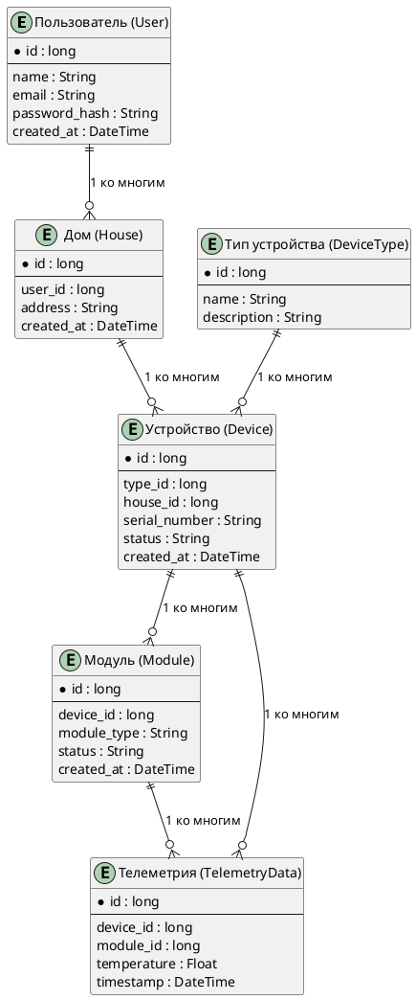

## 1. Идентификация сущностей
- Пользователь (User):
Описывает учетную запись пользователя, который может управлять устройствами в одном или нескольких домах.
- Дом (House):
Описывает объект (дом или помещение), в котором расположены устройства, управляемые пользователем.
- Устройство (Device):
Описывает физическое устройство отопления или датчик температуры, установленное в доме.
- Тип устройства (DeviceType):
Описывает характеристики типа устройства, например, термостат, котел или датчик температуры.
- Модуль (Module):
Описывает компоненты устройства (например, блок управления или модуль измерения температуры), которые могут передавать данные и управляться системой.
- Телеметрия (TelemetryData):
Описывает данные, получаемые от устройств, такие как текущая температура, состояние устройства и прочее.

## 2. Определение атрибутов
### Пользователь (User):
- id: уникальный идентификатор пользователя.
- name: имя пользователя.
- email: электронная почта пользователя.
- password_hash: хэш пароля.
- created_at: дата создания учетной записи.
### Дом (House):
- id: уникальный идентификатор дома.
- user_id: идентификатор пользователя (внешний ключ).
- address: адрес дома.
- created_at: дата добавления дома.
- Устройство (Device):

- id: уникальный идентификатор устройства.
- type_id: идентификатор типа устройства (внешний ключ к DeviceType).
- house_id: идентификатор дома (внешний ключ к House).
- serial_number: серийный номер устройства.
- status: текущее состояние устройства (включено/выключено).
- created_at: дата установки устройства.
### Тип устройства (DeviceType):

- id: уникальный идентификатор типа устройства.
- name: название типа устройства (например, термостат, датчик температуры).
- description: описание типа устройства.

### Модуль (Module):

- id: уникальный идентификатор модуля.
- device_id: идентификатор устройства (внешний ключ).
- module_type: тип модуля (например, управление или датчик).
- status: текущее состояние модуля (активен/неактивен).
- created_at: дата добавления модуля.

### Телеметрия (TelemetryData):

- id: уникальный идентификатор записи телеметрии.
- device_id: идентификатор устройства (внешний ключ).
- module_id: идентификатор модуля (внешний ключ).
- temperature: измеренная температура.
- timestamp: время записи телеметрии.

## 3. Описание связей
   - Пользователь — Дом: один пользователь может иметь несколько домов, но каждый дом связан только с одним пользователем (один ко многим).
   - Дом — Устройство: один дом может содержать несколько устройств, каждое устройство принадлежит только одному дому (один ко многим).
   - Устройство — Модуль: каждое устройство может иметь несколько модулей (например, блок управления и датчики) (один ко многим).
   - Устройство — Телеметрия: одно устройство может генерировать множество записей телеметрии (один ко многим).
   - Модуль — Телеметрия: один модуль может генерировать множество записей телеметрии (один ко многим).
   - Тип устройства — Устройство: один тип устройства может применяться к нескольким устройствам (один ко многим).
## 4. Построение ER-диаграммы

## 5. Описание ER-диаграммы
   * Пользователь (User) может иметь несколько домов (один ко многим).
   * Дом (House) может содержать несколько устройств (один ко многим).
   * Устройство (Device) может быть связано с несколькими модулями и генерировать записи телеметрии (один ко многим).
   * Тип устройства (DeviceType) описывает характеристики устройств и связывается с ними (один ко многим).
   * Модуль (Module) связан с устройством и может передавать данные в телеметрию (один ко многим).
   * Телеметрия (TelemetryData) хранит данные, получаемые от устройств и их модулей (один ко многим).