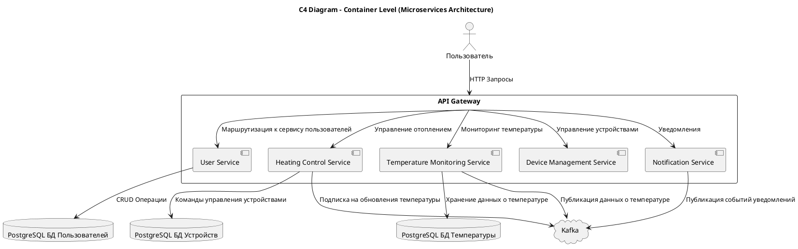
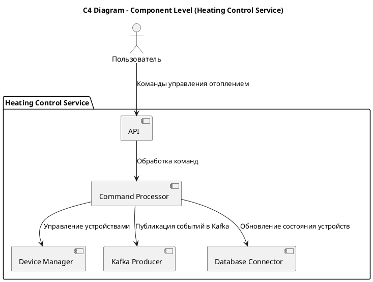
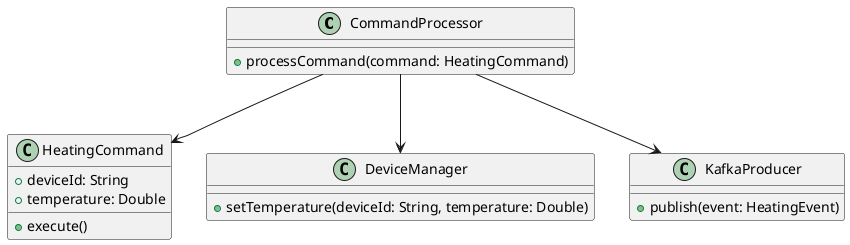

## 1. Декомпозиция на микросервисы
   Основываясь на функциональных блоках и доменах, определенных ранее (управление отоплением, мониторинг температуры), предлагаем следующую структуру микросервисов:

* User Service (Сервис Пользователей) Аутентификация и авторизация пользователей. Управление учетными записями пользователей и настройками.
* Heating Control Service (Сервис Управления Отоплением) Управление устройствами отопления (включение/выключение, установка температуры).
Обработка команд пользователей и отправка их на устройства.
* Temperature Monitoring Service (Сервис Мониторинга Температуры)
Получение данных с датчиков температуры.
Хранение и предоставление данных пользователям для мониторинга текущей температуры.
* Device Management Service (Сервис Управления Устройствами)
Управление устройствами IoT (регистрация устройств, обновление прошивки, диагностика).
* Notification Service (Сервис Уведомлений)
Отправка уведомлений пользователям (например, о выходе температуры за заданные рамки).
* API Gateway
Центральная точка доступа для всех внешних запросов.
Обеспечивает маршрутизацию запросов к нужным микросервисам и безопасность.
* Message Broker (Kafka)
Используется для асинхронного взаимодействия микросервисов, передачи сообщений между сервисами, например, уведомления о температурных событиях.
PostgreSQL База данных
Хранение данных пользователей, настроек устройств, журналов температуры.
## 2. Определение взаимодействия
   Основное взаимодействие между микросервисами будет происходить через следующие компоненты:

API Gateway: Обрабатывает внешние запросы и маршрутизирует их в нужные микросервисы.
Kafka: Используется для передачи событий между микросервисами (например, события изменения температуры или обновления состояния устройств).
База данных: Каждая служба работает с отдельной базой данных (паттерн базы данных на микросервис), однако Kafka будет использоваться для синхронизации между микросервисами.
## 3. Визуализация архитектуры
   C4 — Уровень контейнеров (Containers)

Создадим диаграмму контейнеров, которая отображает, как микросервисы взаимодействуют с внешними системами и друг с другом.

### C4 — Уровень компонентов (Components)

На уровне компонентов детализируем, как организован один из ключевых микросервисов, например, Heating Control Service. Этот сервис управляет устройствами отопления и взаимодействует с другими микросервисами через Kafka.

### C4 — Уровень кода (Code)

На уровне кода можно показать, как реализован, например, Command Processor в микросервисе Heating Control Service. Ниже приведена упрощенная UML-диаграмма классов.

